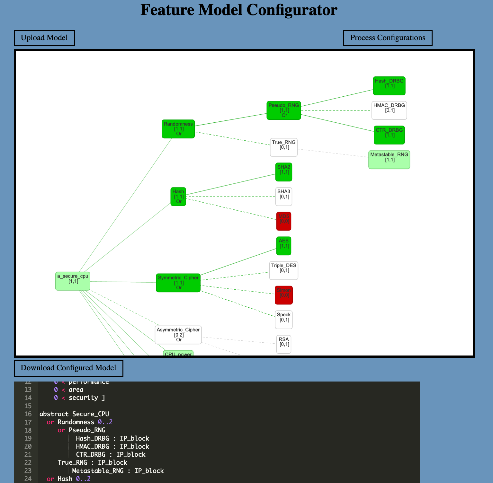

# Feature Model Configurator UI




The UI provides several features listed below. The list describes a
typical workflow with the UI:

- *Load a feature model*: from the local file system. The file is
  parsed using Clafer in the backend and then displayed to the user in
  a graphical tree-like structure. Some examples of feature models are
  provided in the `examples/` folder of the repo.

- *Select features*: by clicking on the different features. It is
  possible to `select`, `unselect`, or `unconfigure` features. By
  default features are unconfigured, shown in blank nodes. Once
  selected or unselected, the feature is colored green or red.

- *Process configurations*: once a round of feature selection is done,
  process the selection by pressing the corresponding button. The
  backend analyzes the selection with according to the feature model
  and returns the model with additional *constraints* encoding the
  selection of features. This is shown in the text editor at the
  bottom of the webpage, ready for review. Currently, the constraints
  are inserted at the end of the file.

- *Download configured model*: by clicking on the button, save the
  configured model (model + constraints) to a filesystem.


## Requirements

- python3
- pip3
- The `flask` web server:
```
pip3 install flask
```
- a web browser

## Running the configurator

To start the feature model configurator, first start the web server:
using one of the following command:

```
python3 server_flask.py
BESSPIN_CLAFER=<path-to-clafer> python3 server_flask.py
```

The second command is to indicate a specfic version of `clafer`,
otherwise it will use whatever version of clafer is in the `PATH`.

User starts the UI by going to:
```
http://localhost:3784/
```


# Future work

- save and restore working session
- integrate a configurator algorithm
- enhance user interactions to facilitate exploration of feature selections