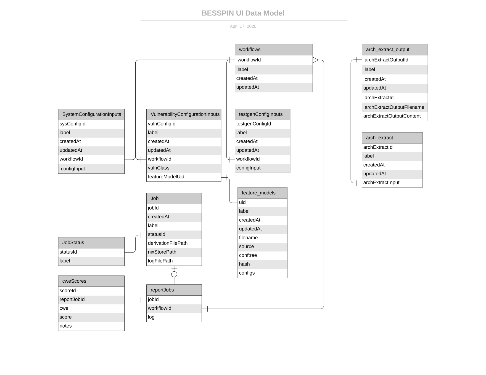

# BESSPIN API

This document is meant to give background on the overall design of the API layer for
the BESSPIN UI.

## Libraries Used

This API server is written using [Flask](https://www.palletsprojects.com/p/flask/). It utilizes [Flask-RestPlus](https://flask-restplus.readthedocs.io/en/stable/) to add support for generating [Swagger](https://swagger.io/solutions/api-documentation/) documentation. Data modeling is done with [SQLAlchemy](https://www.sqlalchemy.org/) which includes support for schema migrations (via [Alembic](https://alembic.sqlalchemy.org/en/latest/)). The API endpoints are organized leveraging [Blueprints](https://flask.palletsprojects.com/en/1.0.x/blueprints/).

## Project Structure

The API server portion of BESSPIN is structured as follows:

```
/server
    /app
        __init__.py <-- "create_app" Flask factory
        /api <-- Blueprint-based "file-per-REST-resource" files
        /lib <-- supporting library code
        /models <-- SQLAlchemy ORM models
    /migrations <-- Alembic configuration for database migrations
    /tests <-- unittest-based tests
    app.py <-- entry point for running the server
    commands.py <-- Additional Flask commands for running unit tests
    config.py <-- Flask application configuration file
    requirements.txt <-- explicit configuration of dependency versions
```

## Data Model

Leveraging SQLAlchemy's [declarative mapping](https://docs.sqlalchemy.org/en/13/orm/mapping_styles.html), the models are a reflection of the following data model:



Two important things to note:

1) There is a [meta-data-mixin](./models/metadata_mixin.py) which encapsulates common model meta-data (human-friendly "label", creation-date, and last-update)
2) The "jobs" base model is related to the specific "*job" models using SQLAlchemy's [joined table inheritance](https://docs.sqlalchemy.org/en/13/orm/inheritance.html#joined-table-inheritance)

## API Endpoints

All modules for the API endpoints themselves have three things to note

### Namespacing

All modules start off defining a [route namespace](https://flask-restplus.readthedocs.io/en/stable/scaling.html) similar to the following:

```python
ns = api.namespace(
    'some-namespace',
    description='One line description of the routes in this namespace'
)
```

This will ensure that all the routes defined in the module (via `@ns.route('foo')`) will map to a URI path `/api/some-namespace/foo`.

### Swagger Documentation

All API endpoints have [api.model](https://flask-restplus.readthedocs.io/en/stable/marshalling.html) defined for each of the objects that will be returned via the endpoints in that module.

If there is data that will be `POST`/`PUT` to any of the endpoints, then there will also be `api.model` for each of those payloads.

The models are then applied to the endpoints using:

#### @api.marshal_with and @api.marshal_list_with

The model used will basically apply a "filter" to the returned response, limiting the fields returned to those defined in the model

#### @api.expect

The model will be used to validate the incoming payload to be the correct shape.

### Resourceful Routing

The endpoints are defined using [Flask-RestPlus Resource]() as the base class defined as follows:

```python
from api.models import db, Bar

ns = api.namespace('my-foo', 'manages foo')

new_bar_model = ns.model('NewBarModel', {
    'label': fields.String(required=False, description='optional human-friendly name'),
    'value': fields.String(required=True, description='some value')
})

existing_bar_model = ns.inherit('ExistingBarModel', new_bar_model, {
    'id': fields.Integer(required=True, description='unique identifier'),
})

@ns.route('/bar')
class FooBar(Resource):
    @ns.marshal_list_with(existing_bar_model)
    def get(self):
        return Bar.query.all()

    @ns.marshal_with(existing_bar_model)
    @ns.expect(new_bar_model)
    def post(self):
        new_bar_data = json.loads(request.data)
        bar = Bar(
            label=new_bar_data['label'],
            value=new_bar_darta['value']
        )
        db.session.add(bar)
        db.session.commit()

        return bar
```

## Testing

Unit tests for both the data models and API routes are located in `server/tests`. You can run the tests via:

```
flask test unit
```

### Coverage Analysis

You can also generate test coverage reporting by running:

```
flask test unit --coverage
```

This should write an output file to `server/tmp/coverage/index.html` which you can open in your browser.

### Test-driving the API

There is an included [Postman collection configuration](BESSPIN.postman_collection.json) file if you use [Postman](https://www.getpostman.com/) which you can easily `import` into the Postman application.

#### Configuring Your "apiHost"

The collection of Postman requests use an `{{apiHost}}` [variable](https://learning.getpostman.com/docs/postman/variables-and-environments/variables/) that you will need to configure to indicate what the host IP/port is for your API instance. Once you have that, you can test-drive out the API endpoints.